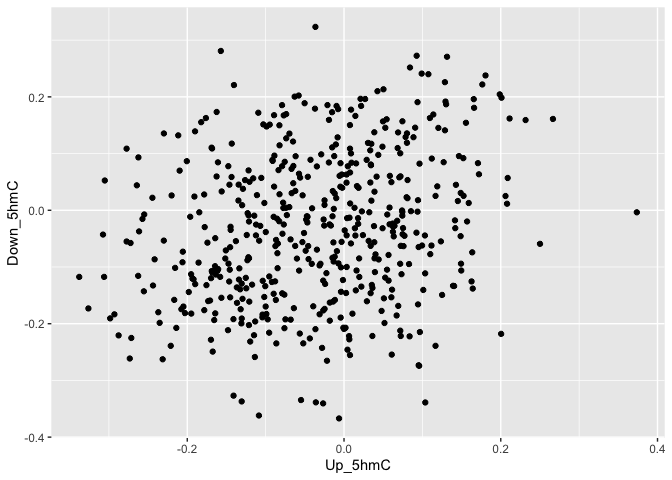
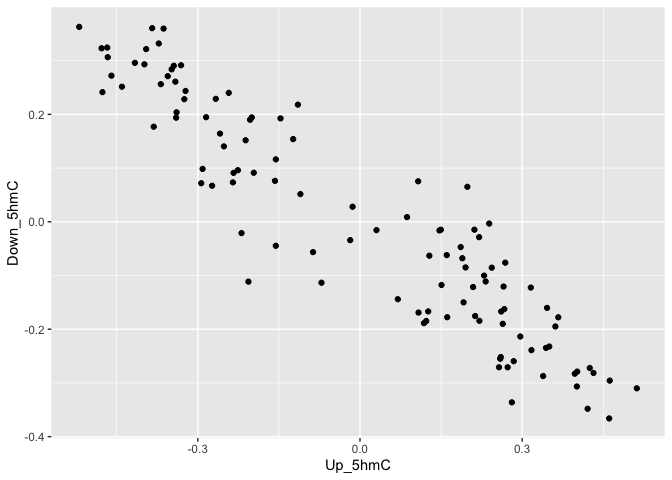
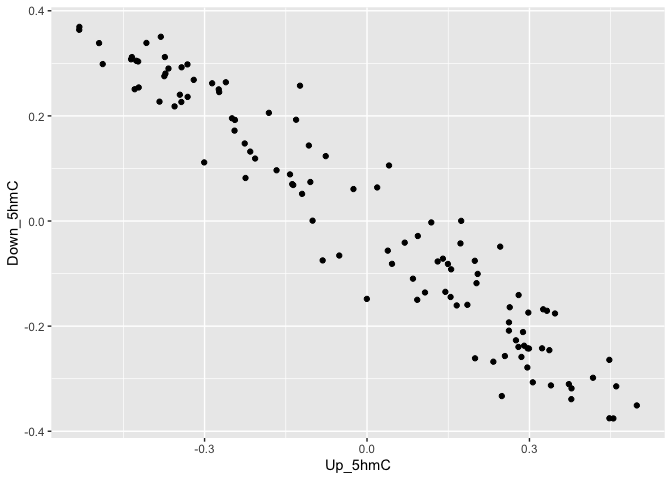

GSVA Kocak dataset, 5hmC counts and 5hmC counts TPM
================
Gepoliano Chaves, Ph. D.
July 26th, 2021

# 1\) Load Required Libraries

``` r
# DGE DESeq2, PCA and Heatmap
library(readxl)
library(DESeq2)
library(ggfortify)
library(ComplexHeatmap)
library(cluster)
library(fgsea)
library(DT)
library(tibble)
library(dplyr)

## Enrichment and Pathway Analysis
library(clusterProfiler)
library(enrichplot)
library(ggplot2)
library(enrichR)
library(pheatmap)

## Dimension Reduction UMAP and tSNE
library(Rtsne)
library(umap)

## Function: drop_na() -> Drop rows containing missing values
library("tidyr")
## Read a delimited file (including csv & tsv) into a tibble
library("readr")

## GSVA Analysis
library(GSVA)
library(GSVAdata)
library(GSEABase)

library(hrbrthemes)
library(viridis)
library("ggpubr")

library(data.table)
library(tidyverse)
```

# 2\) Gene Expression Matrices

# 2.1) Kocak Gene Expression Matrix

``` r
GSE49711 <-read.delim(
  "./GSE49711.txt", 
  check.names=FALSE)

rownames(GSE49711) <- GSE49711$Gene
GSE49711 <- subset(GSE49711, select = -c(Gene))
GSE49711_GeneMatrix <- as.matrix(GSE49711)
```

# 2.2) 5hmC Counts and TPM Gene Expression Matrices

``` r
counts_matrix <- read.delim("./count_matrix_geo1.txt",
                            check.names = FALSE)

## create TPM function
counts_to_tpm <- function(countMat, geneLengths) {

    rpk = countMat / (geneLengths/1000)          # Reads per kilobase
    scalingFactors = colSums(rpk, na.rm=TRUE) / 10^6   # "Per million" scaling factor
    tpm = t( t(rpk) / scalingFactors)         # Transcripts per million

    return(tpm)
}

## import gene lengths 
gene_length <- read_tsv("~/Desktop/mart_lengths.txt") %>% drop_na() %>% rename(GS = `Gene start (bp)`) %>% 
   rename(GE = `Gene end (bp)`) %>%
   rename(gene = `Gene name`) %>% 
   mutate(length=GE-GS) %>% 
   rename(chrom = `Chromosome/scaffold name`) %>%
   mutate(chrom = as.numeric(chrom)) %>%
   drop_na()
```

    ## 
    ## ── Column specification ────────────────────────────────────────────────────────
    ## cols(
    ##   `Gene name` = col_character(),
    ##   `Chromosome/scaffold name` = col_character(),
    ##   `Gene start (bp)` = col_double(),
    ##   `Gene end (bp)` = col_double()
    ## )

    ## Warning in mask$eval_all_mutate(quo): NAs introduced by coercion

``` r
## generate list of my genes from count matrix 
gene_list <- as.data.frame(counts_matrix$gene) %>% rename(gene = `counts_matrix$gene`)

## annotate my counts matrix with gene length 
x <- left_join(gene_list, gene_length) %>% drop_na() %>%
   left_join(counts_matrix) 
```

    ## Joining, by = "gene"

    ## Joining, by = "gene"

``` r
## identify duplicated genes 
duplicates <-data.frame(table(x$gene)) %>%
   dplyr::filter(Freq>1)

## remove duplicated genes from annotated count matrix 
x <- subset(x, !(x$gene %in% duplicates$Var1))

## remove annotation from count matrix 
counts_matrix2 <- x %>%
   dplyr::select(-chrom, -GE, - GS, -length) %>%
   data.matrix()

## isolate gene legnth & gene list 
gene_length<- x %>% dplyr::select(length)
gene_list <- x %>% dplyr::select(gene)

## run TPM function
tpm <- counts_to_tpm(counts_matrix2, gene_length$length) %>% as.data.frame()

## add gene names 
tpm$gene <- gene_list

## make rownames = first column 
tpm<-tpm[,-1]
rownames(tpm)<-gene_list$gene
```

# 3\) Construct GSVA Data-Frames

# 3.1) Kocak

``` r
cfDNA_PCA_gene_list <- getGmt("./cfDNA_genes_PCA.txt")
```

    ## Warning in readLines(con, ...): incomplete final line found on './
    ## cfDNA_genes_PCA.txt'

    ## Warning in getGmt("./cfDNA_genes_PCA.txt"): 80 record(s) contain duplicate ids:
    ## ADRN_Gronigen, ADRN_Gronigen_F3, ..., Up_5hmC_Top_LFC, Up_RNA

``` r
GSE49711_GSVA <- gsva(GSE49711_GeneMatrix, 
                          cfDNA_PCA_gene_list, 
                          min.sz=1, max.sz=Inf, 
                          verbose=TRUE)
```

    ## Warning in .filterFeatures(expr, method): 755 genes with constant expression
    ## values throuhgout the samples.

    ## Warning in .filterFeatures(expr, method): Since argument method!="ssgsea", genes
    ## with constant expression values are discarded.

    ## Warning in .gsva(expr, mapped.gset.idx.list, method, kcdf, rnaseq,
    ## abs.ranking, : Some gene sets have size one. Consider setting 'min.sz > 1'.

    ## Estimating GSVA scores for 79 gene sets.
    ## Estimating ECDFs with Gaussian kernels
    ##   |                                                                              |                                                                      |   0%  |                                                                              |=                                                                     |   1%  |                                                                              |==                                                                    |   3%  |                                                                              |===                                                                   |   4%  |                                                                              |====                                                                  |   5%  |                                                                              |====                                                                  |   6%  |                                                                              |=====                                                                 |   8%  |                                                                              |======                                                                |   9%  |                                                                              |=======                                                               |  10%  |                                                                              |========                                                              |  11%  |                                                                              |=========                                                             |  13%  |                                                                              |==========                                                            |  14%  |                                                                              |===========                                                           |  15%  |                                                                              |============                                                          |  16%  |                                                                              |============                                                          |  18%  |                                                                              |=============                                                         |  19%  |                                                                              |==============                                                        |  20%  |                                                                              |===============                                                       |  22%  |                                                                              |================                                                      |  23%  |                                                                              |=================                                                     |  24%  |                                                                              |==================                                                    |  25%  |                                                                              |===================                                                   |  27%  |                                                                              |===================                                                   |  28%  |                                                                              |====================                                                  |  29%  |                                                                              |=====================                                                 |  30%  |                                                                              |======================                                                |  32%  |                                                                              |=======================                                               |  33%  |                                                                              |========================                                              |  34%  |                                                                              |=========================                                             |  35%  |                                                                              |==========================                                            |  37%  |                                                                              |===========================                                           |  38%  |                                                                              |===========================                                           |  39%  |                                                                              |============================                                          |  41%  |                                                                              |=============================                                         |  42%  |                                                                              |==============================                                        |  43%  |                                                                              |===============================                                       |  44%  |                                                                              |================================                                      |  46%  |                                                                              |=================================                                     |  47%  |                                                                              |==================================                                    |  48%  |                                                                              |===================================                                   |  49%  |                                                                              |===================================                                   |  51%  |                                                                              |====================================                                  |  52%  |                                                                              |=====================================                                 |  53%  |                                                                              |======================================                                |  54%  |                                                                              |=======================================                               |  56%  |                                                                              |========================================                              |  57%  |                                                                              |=========================================                             |  58%  |                                                                              |==========================================                            |  59%  |                                                                              |===========================================                           |  61%  |                                                                              |===========================================                           |  62%  |                                                                              |============================================                          |  63%  |                                                                              |=============================================                         |  65%  |                                                                              |==============================================                        |  66%  |                                                                              |===============================================                       |  67%  |                                                                              |================================================                      |  68%  |                                                                              |=================================================                     |  70%  |                                                                              |==================================================                    |  71%  |                                                                              |===================================================                   |  72%  |                                                                              |===================================================                   |  73%  |                                                                              |====================================================                  |  75%  |                                                                              |=====================================================                 |  76%  |                                                                              |======================================================                |  77%  |                                                                              |=======================================================               |  78%  |                                                                              |========================================================              |  80%  |                                                                              |=========================================================             |  81%  |                                                                              |==========================================================            |  82%  |                                                                              |==========================================================            |  84%  |                                                                              |===========================================================           |  85%  |                                                                              |============================================================          |  86%  |                                                                              |=============================================================         |  87%  |                                                                              |==============================================================        |  89%  |                                                                              |===============================================================       |  90%  |                                                                              |================================================================      |  91%  |                                                                              |=================================================================     |  92%  |                                                                              |==================================================================    |  94%  |                                                                              |==================================================================    |  95%  |                                                                              |===================================================================   |  96%  |                                                                              |====================================================================  |  97%  |                                                                              |===================================================================== |  99%  |                                                                              |======================================================================| 100%

``` r
GSE49711_GSVA <- data.frame(t(GSE49711_GSVA))

## Creates the filenames column
GSE49711_GSVA['filenames'] <- rownames(GSE49711_GSVA)
```

# 3.2) 5hmC counts

``` r
cfDNA_PCA_gene_list <- getGmt("./cfDNA_genes_PCA.txt")
```

    ## Warning in readLines(con, ...): incomplete final line found on './
    ## cfDNA_genes_PCA.txt'

    ## Warning in getGmt("./cfDNA_genes_PCA.txt"): 80 record(s) contain duplicate ids:
    ## ADRN_Gronigen, ADRN_Gronigen_F3, ..., Up_5hmC_Top_LFC, Up_RNA

``` r
row.names(counts_matrix) <- counts_matrix$gene
counts_matrix <- subset(counts_matrix, select = -c(gene))
counts_matrix <- as.matrix(counts_matrix)

counts_matrix_GSVA <- gsva(counts_matrix, 
                          cfDNA_PCA_gene_list, 
                          min.sz=1, max.sz=Inf, 
                          verbose=TRUE)
```

    ## Warning in .filterFeatures(expr, method): 1202 genes with constant expression
    ## values throuhgout the samples.

    ## Warning in .filterFeatures(expr, method): Since argument method!="ssgsea", genes
    ## with constant expression values are discarded.

    ## Warning in .gsva(expr, mapped.gset.idx.list, method, kcdf, rnaseq,
    ## abs.ranking, : Some gene sets have size one. Consider setting 'min.sz > 1'.

    ## Estimating GSVA scores for 79 gene sets.
    ## Estimating ECDFs with Gaussian kernels
    ##   |                                                                              |                                                                      |   0%  |                                                                              |=                                                                     |   1%  |                                                                              |==                                                                    |   3%  |                                                                              |===                                                                   |   4%  |                                                                              |====                                                                  |   5%  |                                                                              |====                                                                  |   6%  |                                                                              |=====                                                                 |   8%  |                                                                              |======                                                                |   9%  |                                                                              |=======                                                               |  10%  |                                                                              |========                                                              |  11%  |                                                                              |=========                                                             |  13%  |                                                                              |==========                                                            |  14%  |                                                                              |===========                                                           |  15%  |                                                                              |============                                                          |  16%  |                                                                              |============                                                          |  18%  |                                                                              |=============                                                         |  19%  |                                                                              |==============                                                        |  20%  |                                                                              |===============                                                       |  22%  |                                                                              |================                                                      |  23%  |                                                                              |=================                                                     |  24%  |                                                                              |==================                                                    |  25%  |                                                                              |===================                                                   |  27%  |                                                                              |===================                                                   |  28%  |                                                                              |====================                                                  |  29%  |                                                                              |=====================                                                 |  30%  |                                                                              |======================                                                |  32%  |                                                                              |=======================                                               |  33%  |                                                                              |========================                                              |  34%  |                                                                              |=========================                                             |  35%  |                                                                              |==========================                                            |  37%  |                                                                              |===========================                                           |  38%  |                                                                              |===========================                                           |  39%  |                                                                              |============================                                          |  41%  |                                                                              |=============================                                         |  42%  |                                                                              |==============================                                        |  43%  |                                                                              |===============================                                       |  44%  |                                                                              |================================                                      |  46%  |                                                                              |=================================                                     |  47%  |                                                                              |==================================                                    |  48%  |                                                                              |===================================                                   |  49%  |                                                                              |===================================                                   |  51%  |                                                                              |====================================                                  |  52%  |                                                                              |=====================================                                 |  53%  |                                                                              |======================================                                |  54%  |                                                                              |=======================================                               |  56%  |                                                                              |========================================                              |  57%  |                                                                              |=========================================                             |  58%  |                                                                              |==========================================                            |  59%  |                                                                              |===========================================                           |  61%  |                                                                              |===========================================                           |  62%  |                                                                              |============================================                          |  63%  |                                                                              |=============================================                         |  65%  |                                                                              |==============================================                        |  66%  |                                                                              |===============================================                       |  67%  |                                                                              |================================================                      |  68%  |                                                                              |=================================================                     |  70%  |                                                                              |==================================================                    |  71%  |                                                                              |===================================================                   |  72%  |                                                                              |===================================================                   |  73%  |                                                                              |====================================================                  |  75%  |                                                                              |=====================================================                 |  76%  |                                                                              |======================================================                |  77%  |                                                                              |=======================================================               |  78%  |                                                                              |========================================================              |  80%  |                                                                              |=========================================================             |  81%  |                                                                              |==========================================================            |  82%  |                                                                              |==========================================================            |  84%  |                                                                              |===========================================================           |  85%  |                                                                              |============================================================          |  86%  |                                                                              |=============================================================         |  87%  |                                                                              |==============================================================        |  89%  |                                                                              |===============================================================       |  90%  |                                                                              |================================================================      |  91%  |                                                                              |=================================================================     |  92%  |                                                                              |==================================================================    |  94%  |                                                                              |==================================================================    |  95%  |                                                                              |===================================================================   |  96%  |                                                                              |====================================================================  |  97%  |                                                                              |===================================================================== |  99%  |                                                                              |======================================================================| 100%

``` r
counts_matrix_GSVA <- data.frame(t(counts_matrix_GSVA))

## Creates the filenames column
counts_matrix_GSVA['filenames'] <- rownames(counts_matrix_GSVA)
```

# 3.3) 5hmC TPM

``` r
cfDNA_PCA_gene_list <- getGmt("./cfDNA_genes_PCA.txt")
```

    ## Warning in readLines(con, ...): incomplete final line found on './
    ## cfDNA_genes_PCA.txt'

    ## Warning in getGmt("./cfDNA_genes_PCA.txt"): 80 record(s) contain duplicate ids:
    ## ADRN_Gronigen, ADRN_Gronigen_F3, ..., Up_5hmC_Top_LFC, Up_RNA

``` r
row.names(tpm) <- row.names(tpm)
tpm <- as.matrix(tpm)

TPM_GSVA <- gsva(tpm, 
                 cfDNA_PCA_gene_list,
                 min.sz=1, max.sz=Inf, 
                 verbose=TRUE)
```

    ## Warning in .filterFeatures(expr, method): 1066 genes with constant expression
    ## values throuhgout the samples.

    ## Warning in .filterFeatures(expr, method): Since argument method!="ssgsea", genes
    ## with constant expression values are discarded.

    ## Warning in .gsva(expr, mapped.gset.idx.list, method, kcdf, rnaseq,
    ## abs.ranking, : Some gene sets have size one. Consider setting 'min.sz > 1'.

    ## Estimating GSVA scores for 79 gene sets.
    ## Estimating ECDFs with Gaussian kernels
    ##   |                                                                              |                                                                      |   0%  |                                                                              |=                                                                     |   1%  |                                                                              |==                                                                    |   3%  |                                                                              |===                                                                   |   4%  |                                                                              |====                                                                  |   5%  |                                                                              |====                                                                  |   6%  |                                                                              |=====                                                                 |   8%  |                                                                              |======                                                                |   9%  |                                                                              |=======                                                               |  10%  |                                                                              |========                                                              |  11%  |                                                                              |=========                                                             |  13%  |                                                                              |==========                                                            |  14%  |                                                                              |===========                                                           |  15%  |                                                                              |============                                                          |  16%  |                                                                              |============                                                          |  18%  |                                                                              |=============                                                         |  19%  |                                                                              |==============                                                        |  20%  |                                                                              |===============                                                       |  22%  |                                                                              |================                                                      |  23%  |                                                                              |=================                                                     |  24%  |                                                                              |==================                                                    |  25%  |                                                                              |===================                                                   |  27%  |                                                                              |===================                                                   |  28%  |                                                                              |====================                                                  |  29%  |                                                                              |=====================                                                 |  30%  |                                                                              |======================                                                |  32%  |                                                                              |=======================                                               |  33%  |                                                                              |========================                                              |  34%  |                                                                              |=========================                                             |  35%  |                                                                              |==========================                                            |  37%  |                                                                              |===========================                                           |  38%  |                                                                              |===========================                                           |  39%  |                                                                              |============================                                          |  41%  |                                                                              |=============================                                         |  42%  |                                                                              |==============================                                        |  43%  |                                                                              |===============================                                       |  44%  |                                                                              |================================                                      |  46%  |                                                                              |=================================                                     |  47%  |                                                                              |==================================                                    |  48%  |                                                                              |===================================                                   |  49%  |                                                                              |===================================                                   |  51%  |                                                                              |====================================                                  |  52%  |                                                                              |=====================================                                 |  53%  |                                                                              |======================================                                |  54%  |                                                                              |=======================================                               |  56%  |                                                                              |========================================                              |  57%  |                                                                              |=========================================                             |  58%  |                                                                              |==========================================                            |  59%  |                                                                              |===========================================                           |  61%  |                                                                              |===========================================                           |  62%  |                                                                              |============================================                          |  63%  |                                                                              |=============================================                         |  65%  |                                                                              |==============================================                        |  66%  |                                                                              |===============================================                       |  67%  |                                                                              |================================================                      |  68%  |                                                                              |=================================================                     |  70%  |                                                                              |==================================================                    |  71%  |                                                                              |===================================================                   |  72%  |                                                                              |===================================================                   |  73%  |                                                                              |====================================================                  |  75%  |                                                                              |=====================================================                 |  76%  |                                                                              |======================================================                |  77%  |                                                                              |=======================================================               |  78%  |                                                                              |========================================================              |  80%  |                                                                              |=========================================================             |  81%  |                                                                              |==========================================================            |  82%  |                                                                              |==========================================================            |  84%  |                                                                              |===========================================================           |  85%  |                                                                              |============================================================          |  86%  |                                                                              |=============================================================         |  87%  |                                                                              |==============================================================        |  89%  |                                                                              |===============================================================       |  90%  |                                                                              |================================================================      |  91%  |                                                                              |=================================================================     |  92%  |                                                                              |==================================================================    |  94%  |                                                                              |==================================================================    |  95%  |                                                                              |===================================================================   |  96%  |                                                                              |====================================================================  |  97%  |                                                                              |===================================================================== |  99%  |                                                                              |======================================================================| 100%

``` r
TPM_GSVA <- data.frame(t(TPM_GSVA))

## Creates the filenames column
TPM_GSVA['filenames'] <- rownames(TPM_GSVA)
```

# 4\) Plot GSVA Scores

``` r
## GSVA Kocak dataset
qplot(Up_5hmC, Down_5hmC, data = GSE49711_GSVA)
```

<!-- -->

``` r
## GSVA 5hmC w/o TPM normalization
qplot(Up_5hmC, Down_5hmC, data = counts_matrix_GSVA)
```

<!-- -->

``` r
## GSVA 5hmC w/ TPM normalization
qplot(Up_5hmC, Down_5hmC, data = TPM_GSVA)
```

<!-- -->

# 5\) Evaluate KAS-Seq Super-Enhancers in ADRN and MES clustering of cells

  - Transfer BED and GTF files to joint GSVA analysis folder

  - Turn off chunk evaluation

<!-- end list -->

``` bash
cp ~/Desktop/Gepoliano/bedtools_super-enhancers/SE_bed_files/ADRN_MES_Ctl_cat_raw* \
~/Desktop/Gepoliano/GSVA\ Scoring\ and\ Survival\ Analysis/
```
